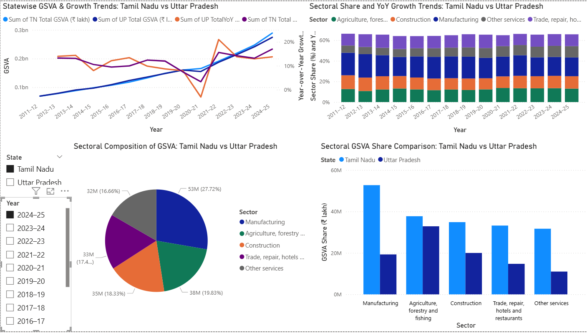

# GSVA Analysis: Tamil Nadu vs Uttar Pradesh

## 📌 Project Overview
This project analyzes **Gross State Value Added (GSVA)** trends of **Tamil Nadu** and **Uttar Pradesh** using data collected from **MOSPI (Ministry of Statistics and Programme Implementation, Government of India)**.  
The analysis covers sectoral growth, state comparisons, and year-over-year (YoY) performance.  

## 📊 Data Sources
- **UP_TN_GSVA_data.xlsx** – Statewise GSVA data
- **GSVA1.xlsx** – Cleaned/derived dataset for dashboard use  
*(Both files are in the `/data` folder)*

## 📈 Dashboard
The Power BI dashboard highlights:
- Statewise GSVA and Growth Trends (2011–2025)
- Sectoral Share and YoY Growth
- Sectoral Composition of GSVA
- Tamil Nadu vs Uttar Pradesh GSVA Share Comparison

## 📊 Data Files
- [GSVA.xlsx](GSVA.xlsx)
- [UP_TN_GSVA_data.xlsx](UP_TN_GSVA_data.xlsx)

## 📈 Dashboard Files
- [Power BI Dashboard (.pbix)](dashboardGSVA_TN_UP.pbix) 

---

## 🔹 Dashboard Preview

---

## 🎥 Screen Recording
👉 [Download the screen recording](dashboarddashboard-demo.mp4)  

---

📌 *Author: Prafulla Kumar Choubey*  
📌 *Data Source: MOSPI*
